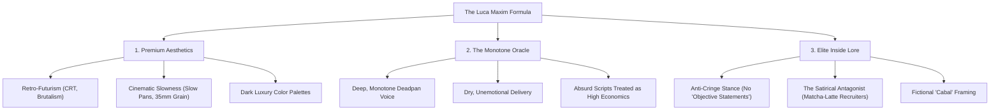

# The Rejectly Pro "Elite Job Knowledge" Marketing Playbook
*Inspired by the Satirical, Surreal, and Premium Aesthetic of Luca Maxim & Azerbaijan Technology*

---

##  EXECUTIVE SUMMARY
This playbook details a high-conversion, highly viral short-form content strategy for **Rejectly Pro**.

Instead of traditional, dry "resume tips," we are adopting the **Luca Maxim Formula**: a combination of **ultra-premium, moody, retro-futuristic aesthetics** and **deadpan, highly ironic corporate satire**. 

By framing job hunting not as a standard chore, but as a "clandestine cyber-operation to bypass the ATS Syndicate Mainframe," we elevate the brand into a cultural movement. This strategy builds high curiosity, drives massive comment-section engagement (the "lore" effect), and commands attention in a saturated market.

---

## 1. THE LUCA MAXIM FORMULA: DECONSTRUCTED

To replicate this style, you must understand its three pillars: **High-Taste Aesthetics**, **The Monotone Oracle (Narration)**, and **Elite Inside Lore**.



### Pillar A: Premium Aesthetics (Anti-AI "Slop")
The visuals must look like a multi-million dollar luxury brand or an indie cyberpunk thriller. **Avoid flashing emojis, high-energy zoomer zooms, or cheap AI-generated cartoon graphics.**
*   **Colors:** Deep charcoals, dark brutalist greys, warm ambers, toxic green glows (CRT monitors), and vintage cream.
*   **Camera Work:** Slow, sweeping horizontal pans, slow vertical tilts, or steady zoom-ins. Motion is controlled and hypnotic.
*   **Post-Production:** Heavy film grain (Cinestill 800t look), subtle lens flares, and slight VHS chromatic aberration.
*   **Captions:** Ultra-minimalist. Centered or near the bottom, medium size, white or warm cream, word-by-word or short phrases appearing cleanly without bouncing effects.

### Pillar B: The Monotone Oracle (The Narration)
The voiceover is the heart of the humor. It must be delivered with **absolute deadpan conviction**. There is zero excitement, zero pitch fluctuation, and a slight, charming international accent (cosmopolitan Eastern European or post-Soviet). 
*   **The Joke:** The funnier and more ridiculous the script, the more seriously the voice must deliver it. 
*   **The Delivery:** It should sound like an elite intelligence officer or a high-level corporate hacker briefing their team.

### Pillar C: Elite Inside Lore (Comment Section Gold)
To drive virality, you need the comment section to engage. This is achieved by introducing "inside jokes" or pseudo-scientific recruiting terms (e.g., "The Oat-Milk Buffer Overrun," "Objective-Statement Radiation," "PDF-Scraping Cabal").
*   When viewers comment: *"What does 'Oat-Milk Buffer Overrun' mean?"*
*   The community (or Rejectly Pro accounts) replies: *"If you have to ask, you don't have Elite Job Knowledge."*
*   This meta-humor builds high-status branding and increases the algorithm's favorability through heavy comments.

---

## 2. THE AI TOOL stack & WORKFLOW

Here is the exact step-by-step workflow and the specific AI tools to execute this visual style:

| Step | Phase | AI Tool | Execution Method |
| :--- | :--- | :--- | :--- |
| **1** | **Visual Assets** | **Midjourney v6** | Generate ultra-stylish base images utilizing custom raw photographic prompts (see prompts below). |
| **2** | **Video Animation** | **Runway Gen-3 Alpha** or **Luma Dream Machine** | Upload the Midjourney image. Prompt with slow camera movements: *"Slow cinematic zoom-in, ambient dust floating, volumetric lighting, high-end production."* |
| **3** | **Voice Cloning** | **Fish Audio** or **ElevenLabs** | Use **Fish Audio** (which has pre-trained Luca Maxim-style voice models) or **ElevenLabs** (cloning a deep, flat, deadpan, slightly accented voice). |
| **4** | **Atmospheric Audio** | **Udio** or **Suno** | Generate background music. Prompt: *"1980s dark ambient synth, slow heavy R&B bassline, lo-fi aesthetic, cinematic, moody, 80 BPM."* |
| **5** | **Video Editing** | **CapCut Desktop** or **Premiere Pro** | Overlay the voice, add the heavy R&B beat (ducked down -15dB), apply film grain, add letterboxes, and generate word-by-word minimalist captions. |

---

## 3. THE MIDJOURNEY AESTHETIC PLAYBOOK
Copy-paste these exact prompt templates into Midjourney to get the premium "Azerbaijan Technology" style visual assets:

### The Clandestine Founder
> `A cinematic film still of a mysterious corporate founder in his late 20s, sharp haircut, wearing a custom double-breasted charcoal Italian wool blazer. He is sitting in a dim brutalist concrete penthouse office in Baku. In the background, amber-glowing vintage CRT monitors displaying terminal code. Moody volumetric lighting, smoke particles drifting, shot on 35mm anamorphic lens, Cinestill 800T, dark academia aesthetic, ultra-premium --ar 9:16 --style raw --v 6.0`

### The Exhausted Corporate Recruiter
> `A cinematic film still close-up of a weary, highly fashionable HR recruiter in her 20s, looking deeply exhausted at four glowing computer screens in a luxury glass office in New York. 3 iced matcha lattes on her sleek desk. Moody dark lighting, emerald green and warm amber ambient tones, high film grain, shot on Alexa 65, cinematic look, ultra-realistic --ar 9:16 --v 6.0`

### The ATS Server Vault
> `A cinematic film still of a massive dark-themed server vault room, brutalist architecture, glowing amber and emerald indicators on tall server racks. A single light beam cutting through heavy industrial mist. Moody, dystopian cyber-thriller vibe, luxury aesthetic, highly detailed, shot on Hasselblad --ar 9:16 --style raw --v 6.0`

---

## 4. HIGH-CONVERSION SCRIPT PLAYBOOKS

Here are four ready-to-produce scripts tailored for **Rejectly Pro**. Use these to generate your voiceovers.

### Script 1: "The Matcha-Latte Coma" (Targeting HR Culture)
*   **Visual Direction:** Slow cinematic zoom-in on the *Exhausted Corporate Recruiter* surrounded by matcha lattes.
*   **Audio:** Moody, slow, deep R&B synth bass looping in the background.
*   **Voiceover Style:** Absolute monotone, slow pace, highly dry.

```
[0:00 - 0:05]
The average corporate recruiter has the attention span of a fruit fly on a low-dose Adderall.
They are fueled entirely by ceremonial grade matcha, double-pump oat milk, and a burning desire to do absolutely nothing.

[0:05 - 0:13]
If they look at your resume and spot a single generic objective statement,
their central nervous system treats it as an active biological threat. 

[0:13 - 0:21]
They will slide your life’s work into the digital furnace before they even digest their gluten-free pastries. 
It is not personal. It is neuro-linguistic self-defense.

[0:21 - 0:29]
To bypass this cognitive shield, you don’t write a resume; you write a database bypass sequence.
Rejectly.pro replaces your "passionate team player" rhetoric with raw corporate compliance parameters.

[0:29 - 0:36]
Their optical sensors scan the document, bypass their conscious brain, and trigger an involuntary dopamine release.
Before they can even circle back or schedule a sync, you are booked for the final round.

[0:36 - 0:42]
Stop begging for a desk.
Infiltrate the mainframe at Rejectly.pro.
```

---

### Script 2: "The Mainframe Infiltration" (Targeting ATS Systems)
*   **Visual Direction:** Slow horizontal pan of the *ATS Server Vault* with flickering amber lights.
*   **Audio:** Heavy vintage synth (reverb-heavy, cyberpunk-luxury tone).
*   **Voiceover Style:** Clandestine, confident, corporate espionage agent.

```
[0:00 - 0:06]
The corporate elite have locked 99% of applicants out of the market.
They did this using proprietary PDF-scraping algorithms designed by MIT dropouts.

[0:06 - 0:13]
They want you to think your background is the problem. 
It is not. Your layout is simply triggering their Times New Roman filters.

[0:13 - 0:20]
Rejectly.pro does not just "build resumes." 
We construct data-compliant transmission devices. 

[0:20 - 0:27]
Our engines inject raw keyword parameters directly into the ATS database.
We bypass the gatekeepers completely.

[0:27 - 0:34]
By the time the human resources department wakes up from their morning meeting, 
your application has already infiltrated their mainframe.

[0:34 - 0:40]
The entry-level gate is open. 
Deploy your campaign at Rejectly.pro.
```

---

### Script 3: "The Font Cartel" (Micro-Niche Viral Humour)
*   **Visual Direction:** Extreme close-up of a finger slowly pressing a keyswitch on a mechanical keyboard in a dark wood-paneled room.
*   **Audio:** Retro 80s darkwave (very slow, moody beat).
*   **Voiceover Style:** Secretive, educational, conspiracy-theorist CEO.

```
[0:00 - 0:05]
There is a silent cartel operating inside corporate recruiting.
It is called the "Font Compliance Syndicate."

[0:05 - 0:12]
If you submit your application in Comic Sans or heavily styled Canva graphics, 
the parser automatically classifies you as a security hazard.

[0:12 - 0:20]
The algorithm does not read your accomplishments. 
It measures your compliance vectors. It demands clean, ATS-optimized architecture.

[0:20 - 0:27]
At Rejectly.pro, we do not let you make artistic mistakes. 
We lock your data into a premium, hyper-readable structural system.

[0:27 - 0:33]
It looks like luxury, but it reads like pure efficiency to the scanning software.

[0:33 - 0:40]
Quit letting a machine dictate your market value.
Bypass the cartel. Use Rejectly.pro.
```

---

### Script 4: "Elite Job Knowledge vs. Amateur Hour" (The Hook-First Strategy)
*   **Visual Direction:** Close-up of the *Clandestine Founder* looking deadpan into the camera, slowly taking a sip of black coffee.
*   **Audio:** Deep ambient drone, extremely premium and cold.
*   **Voiceover Style:** Condescending but highly charismatic, authoritative.

```
[0:00 - 0:06]
Amateurs write cover letters explaining why they "really want the role." 
Nobody cares. The corporation is not a charity.

[0:06 - 0:13]
The elite know that a cover letter is not an essay. 
It is a technical specification document designed to resolve a hiring manager's anxiety.

[0:13 - 0:20]
They have a problem. They have a budget. 
You are the high-efficiency unit that solves it. Nothing more, nothing less.

[0:20 - 0:27]
Our AI engines at Rejectly.pro write cover letters that omit all emotional filler. 
We strip the cringe and replace it with direct, high-value alignment vectors.

[0:27 - 0:34]
They will read three lines and realize you are a professional, 
not a desperate applicant begging for a desk.

[0:34 - 0:40]
Step up your status. 
Secure the mainframe at Rejectly.pro.
```

---

## 5. COMMUNITY ENGAGEMENT PLAYBOOK (BUILDING THE "LORE")

The secret weapon of this strategy is the **comments section**. Here is the protocol for managing comments to create the "Azerbaijan Technology" style community:

### The Comment Protocols:
1.  **Never break character.** If anyone asks a question about the product, reply with deadpan corporate jargon.
2.  **Reward "Elite Knowledge" comments.** Pin comments that play along with the joke.
3.  **Use custom definitions.** Keep a list of fake corporate-cyber jargon ready.

### Examples of Automated Responses to Viral Comments:

| User Comment | Your Official Response (Rejectly Pro Account) |
| :--- | :--- |
| *"Is this a real hacking tool or just a resume builder?"* | *"It is a data-compliant database penetration protocol. Resume is just the legacy term."* |
| *"I applied 5 times and got rejected. What am I doing wrong?"* | *"You have an active Oat-Milk Buffer Overrun in your Skills section. Re-deploy with a Rejectly system update immediately."* |
| *"What font did you use?"* | *"That is a classified security-tier sans-serif. Available exclusively inside the Rejectly terminal."* |
| *"Who is the guy in the suit?"* | *"That is our Director of Mainframe Operations. He does not sleep. He only optimizes."* |

---

## 6. STORYBOARD & VISUAL CUT PLAYBOOK: "THE MATCHA-LATTE COMA"
*A high-taste, multi-cut cinematic narrative sequence (total length: 42 seconds).*

To build a professional short-form video in this style, you need a rapid but calm succession of high-quality visual cuts. Each cut corresponds directly to a line of the voiceover.

| Cut | Time | Script Line | Visual Scene | ChatGPT / Nanobanana Image Prompt | Kling AI Motion Prompt |
| :--- | :--- | :--- | :--- | :--- | :--- |
| **1** | **0:00 - 0:05** | *"The average corporate recruiter has the attention span of a fruit fly on a low-dose Adderall..."* | Wide shot of the exhausted female recruiter staring at multiple screens in a dark, high-end office. | `A vertical editorial film still of a weary, highly fashionable female corporate recruiter, 20s, looking deeply exhausted, sitting in a dark brutalist concrete penthouse office at night. She is staring at multiple glowing computer monitors, casting warm amber and emerald green light onto her face. Photorealistic, 35mm film look, Cinestill 800t, volumetric shadows, moody --ar 9:16` | `Slow cinematic zoom-in, volumetric light particles floating slowly, high quality, 1080p, low motion.` |
| **2** | **0:05 - 0:13** | *"...They are fueled entirely by ceremonial grade matcha, double-pump oat milk, and a burning desire to do absolutely nothing. If they look at your resume..."* | Extreme macro close-up of a premium, sweating cup of iced matcha latte on a dark executive desk. | `An extreme macro cinematic photographic close-up of a premium plastic cup filled with iced green matcha latte on a dark, wet brutalist stone executive desk. Water sweat droplets running down the textured plastic. Swirls of white oat milk blending with dark green matcha inside the ice. Background is a highly blurred high-fashion office with soft amber and green neon highlights, 35mm lens, high film grain, ultra-realistic --ar 9:16` | `Very slow horizontal pan, camera rotating slightly, microscopic dust floating in air, slow motion.` |
| **3** | **0:13 - 0:21** | *"...and spot a single generic objective statement, their central nervous system treats it as an active biological threat. They will slide your life’s work into the digital furnace..."* | A retro-futuristic digital furnace/shredder screen in a dark room showing a text document dissolving into red sparks. | `A cinematic film still of a high-tech vintage terminal screen in a dark brutalist server vault. The screen displays a pixelated text document slowly dissolving and disintegrating into glowing red embers and digital sparks. The surrounding room has cold concrete textures, single golden light beam cutting through industrial mist, 35mm, dark cyber-espionage style --ar 9:16` | `Slow steady zoom-in, embers floating upwards slowly, screen flickering subtly.` |
| **4** | **0:21 - 0:29** | *"...before they even digest their gluten-free pastries. It is not personal. It is neuro-linguistic self-defense. To bypass this cognitive shield, you don’t write a resume..."* | Extreme close-up of hands typing a secure cyber-bypass on a vintage mechanical keyboard with glowing keycap indicators. | `An extreme photographic close-up of elegant hands typing code on a vintage mechanical keyboard in a dark wood-paneled office. The keycaps have a warm orange and green backlight glow. Volumetric smoke particles floating in a single beam of light, heavy 35mm film grain, moody retro-hacker aesthetic --ar 9:16` | `Slow vertical camera tilt upwards, fingers typing smoothly, high quality.` |
| **5** | **0:29 - 0:36** | *"...you write a database bypass sequence. Rejectly.pro replaces your 'passionate team player' rhetoric with raw corporate compliance parameters. Their optical sensors scan..."* | Macro close-up of the recruiter's eye (iris) reflecting digital terminal code lines. | `A cinematic extreme close-up of a human eye iris, highly detailed, reflecting green and amber digital code lines and horizontal scanner lines. The reflection is clear and sharp. Dark surrounding skin, dramatic lighting, shot on macro anamorphic lens, heavy cinematic film grain --ar 9:16` | `Microscopic camera vibration, pupil dilating slowly, light scanner sweeps across the iris.` |
| **6** | **0:36 - 0:39** | *"...the document, bypass their conscious brain, and trigger an involuntary dopamine release. Before they can even circle back..."* | A comical towering stack of 15 empty green matcha cups on the recruiter's desk. The weary female recruiter is sitting in her chair, heavily huffing and puffing in sheer frustration, blowing a strand of hair out of her face. | `A vertical cinematic photographic film still of a high-end office desk cluttered with a comical, towering stack of 15 empty green plastic matcha latte cups. The young weary female recruiter is sitting in her ergonomic chair in the background, looking extremely frustrated and exhausted, blowing a strand of hair out of her eyes. Dark and moody brutalist office room, soft amber lighting, heavy 35mm film grain --ar 9:16` | `Image-to-video rendering. The towering stack of empty matcha cups remains perfectly still on the desk. The exhausted recruiter sits in her chair and heavily huffing and puffing in sheer frustration, taking deep dramatic sighs and blowing a loose strand of hair away from her forehead. The computer monitor in the background remains completely still. Volumetric dust floats slowly in the dark penthouse office. Slow, steady cinematic camera zoom-in. Ultra-realistic, 4k.` |
| **7** | **0:39 - 0:42** | *"...you are booked for the final round. Infiltrate the mainframe at Rejectly.pro."* | Wide shot of the mysterious, deadpan corporate founder in a charcoal double-breasted suit looking intensely at the camera in his brutalist penthouse. | `A vertical cinematic film still of a handsome corporate founder in his late 20s, sharp haircut, wearing a premium double-breasted charcoal Italian wool suit. He is sitting behind a dark slate desk in a brutalist luxury penthouse looking deadpan directly into the camera. He is slowly holding a high-end black ceramic mug. Volumetric moody warm light, minimalist dark luxury, Cinestill 800t --ar 9:16` | `Image-to-video rendering. The handsome corporate founder in the charcoal double-breasted suit stares deadpan directly into the camera. He takes a very slow, calm breath, maintaining intense eye contact without blinking. The black ceramic mug in his hand remains completely still. In the background, the minimalist brutalist concrete penthouse remains perfectly static. Volumetric warm light dust particles float slowly in the air. Slow, steady cinematic camera zoom-in on his eyes. 4k, photorealistic, high quality.` |

---

> [!TIP]
> **Actionable Next Step:** 
> 1. Head over to **ElevenLabs** or **Fish Audio** and generate the voiceover for **Script 1 (The Matcha-Latte Coma)** using a deep, flat post-Soviet male voice (e.g., Luca Maxim style).
> 2. Generate the **7 base images** using the specific ChatGPT/Nanobanana prompts in Section 6.
> 3. Upload each still image into **Kling AI** and apply the corresponding motion prompts and settings.
> 4. Assemble the animated 3-6 second cuts sequentially in **CapCut**, sync with the voiceover, add a slow dark R&B beat, and add centered minimalist captions.

